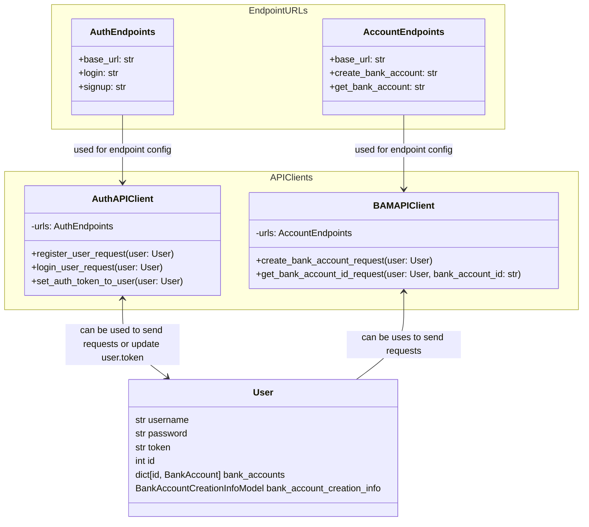

### Main objects and their relationships

```mermaid
classDiagram
direction TB
	namespace EndpointURLs {
        class AccountEndpoints {
	        +base_url: str
	        +create_bank_account: str
	        +get_bank_account: str
        }

        class AuthEndpoints {
	        +base_url: str
	        +login: str
	        +signup: str
        }

	}
	namespace APIClients {
        class BAMAPIClient {
	        -urls: AccountEndpoints
	        +create_bank_account_request(user: User)
	        +get_bank_account_id_request(user: User, bank_account_id: str)
        }

        class AuthAPIClient {
	        -urls: AuthEndpoints
	        +register_user_request(user: User)
	        +login_user_request(user: User)
	        +set_auth_token_to_user(user: User)
        }

	}
    class User {
	    str username
	    str password
	    str token
	    int id
	    dict[id, BankAccount] bank_accounts
	    BankAccountCreationInfoModel bank_account_creation_info
    }

    AuthEndpoints --> AuthAPIClient: used for endpoint config
    AuthAPIClient <--> User: can be used to send requests or update user.token
    AccountEndpoints --> BAMAPIClient: used for endpoint config
    BAMAPIClient <-- User : can be uses to send requests

```
