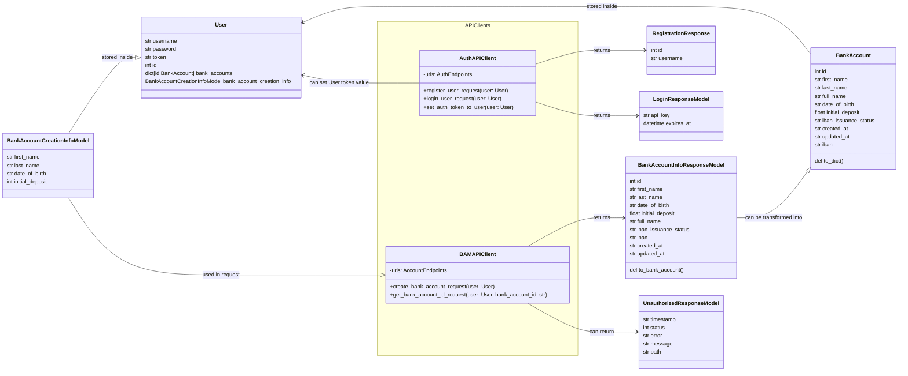

### Models used in the test framework

```mermaid
classDiagram
direction LR
	class User {
	        str username
	        str password
	        str token
	        int id
	        dict[id,BankAccount] bank_accounts
	        BankAccountCreationInfoModel bank_account_creation_info
        }
	namespace APIClients {
        class BAMAPIClient {
	        -urls: AccountEndpoints
	        +create_bank_account_request(user: User)
	        +get_bank_account_id_request(user: User, bank_account_id: str)
        }

        class AuthAPIClient {
	        -urls: AuthEndpoints
	        +register_user_request(user: User)
	        +login_user_request(user: User)
	        +set_auth_token_to_user(user: User)
        }

	}
    class BankAccount {
	    int id
	    str first_name
	    str last_name
	    str full_name
	    str date_of_birth
	    float initial_deposit
	    str iban_issuance_status
	    str created_at
	    str updated_at
	    str iban
	    def to_dict()
    }

    class BankAccountCreationInfoModel {
	    str first_name
	    str last_name
	    str date_of_birth
	    int initial_deposit
    }

    class BankAccountInfoResponseModel {
	    int id
	    str first_name
	    str last_name
	    str date_of_birth
	    float initial_deposit
	    str full_name
	    str iban_issuance_status
	    str iban
	    str created_at
	    str updated_at
	    def to_bank_account()
    }

    class RegistrationResponse {
	    int id
	    str username
    }

    class UnauthorizedResponseModel {
	    str timestamp
	    int status
	    str error
	    str message
	    str path
    }

    class LoginResponseModel {
	    str api_key
	    datetime expires_at
    }

    User <-- BankAccount : stored inside
    BankAccountCreationInfoModel --|> User : stored inside
    BAMAPIClient --> BankAccountInfoResponseModel : returns
    AuthAPIClient --> RegistrationResponse : returns
    BAMAPIClient --> UnauthorizedResponseModel : can return
    AuthAPIClient --> LoginResponseModel : returns
    BankAccountCreationInfoModel --|> BAMAPIClient : used in request
    BankAccountInfoResponseModel --|> BankAccount : can be transformed into
    User <-- AuthAPIClient : can set User.token value 
```
