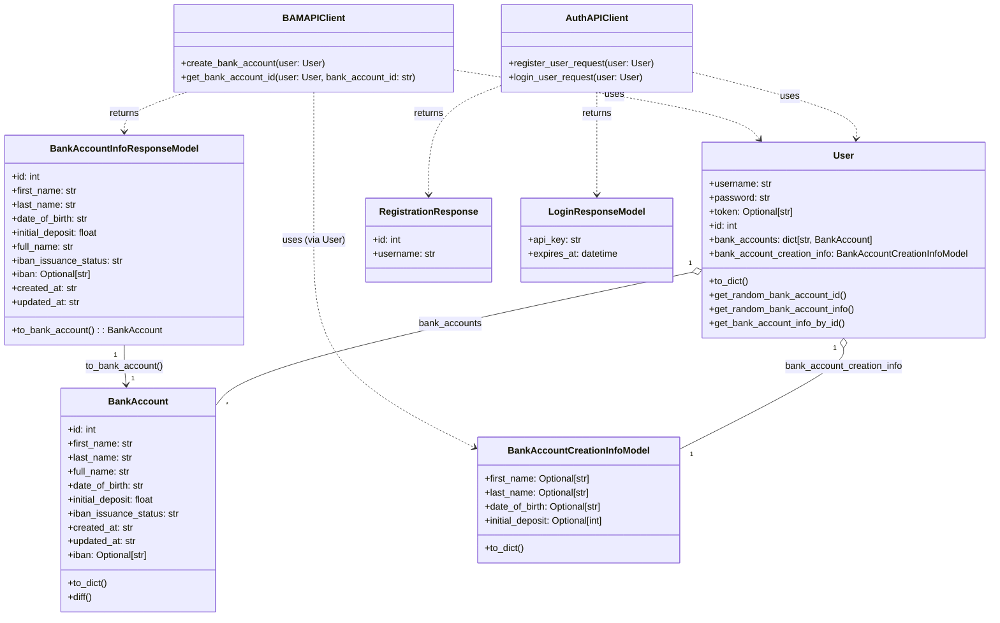

# SumUp Bank Account Automation Suite

## Overview

This project provides a robust, extensible, and maintainable automation suite for validating the bank account creation flow of the SumUp QA challenge. It is designed for easy configuration, clear reporting, and seamless extension as requirements evolve.

---

## System Architecture

Below is a UML-style class diagram (Mermaid) showing the relationships between API clients, models, and their interactions:

**How to read this diagram:**  
- Solid lines (`o--`, `--`) show composition/aggregation (e.g., `User` has many `BankAccount`).
- Dashed lines (`..>`) show usage or return types (e.g., `AuthAPIClient` returns `RegistrationResponse`).
- Methods on models/clients are shown for key interactions.
- API Clients use models for requests and responses.

---

## [Add further sections here for: Setup, Running Tests, Configuration, Reporting, Known Issues, TODOs, etc.]
