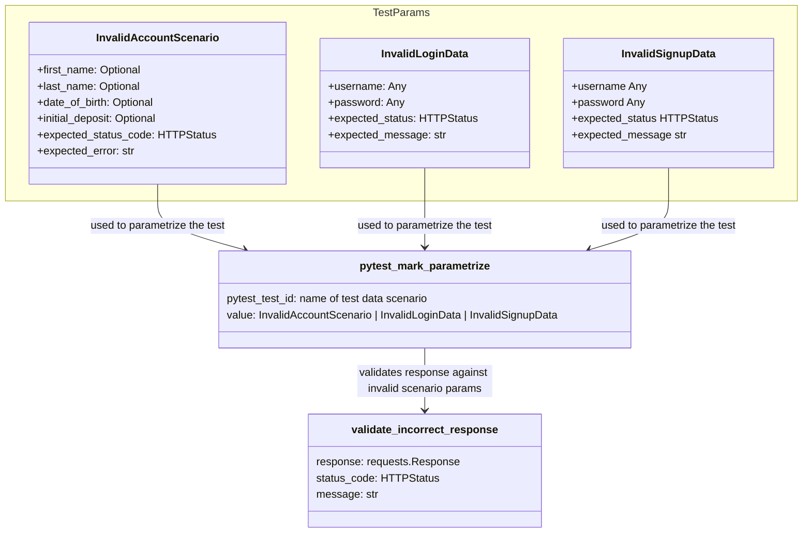

### Test data models

```mermaid
classDiagram
direction BT
	namespace TestParams {
        class InvalidAccountScenario {
	        +first_name: Optional
	        +last_name: Optional
	        +date_of_birth: Optional
	        +initial_deposit: Optional
	        +expected_status_code: HTTPStatus
	        +expected_error: str
        }

        class InvalidLoginData {
	        +username: Any
	        +password: Any
	        +expected_status: HTTPStatus
	        +expected_message: str
        }

        class InvalidSignupData {
	        +username Any
	        +password Any
	        +expected_status HTTPStatus
	        +expected_message str
        }

	}
    class pytest_mark_parametrize {
	    pytest_test_id: name of test data scenario
	    value: InvalidAccountScenario | InvalidLoginData | InvalidSignupData
    }

    class validate_incorrect_response {
	    response: requests.Response
	    status_code: HTTPStatus
	    message: str
    }

    validate_incorrect_response <-- pytest_mark_parametrize : validates response against invalid scenario params
    pytest_mark_parametrize <-- InvalidAccountScenario : used to parametrize the test
    pytest_mark_parametrize <-- InvalidLoginData : used to parametrize the test
    pytest_mark_parametrize <-- InvalidSignupData : used to parametrize the test
```
